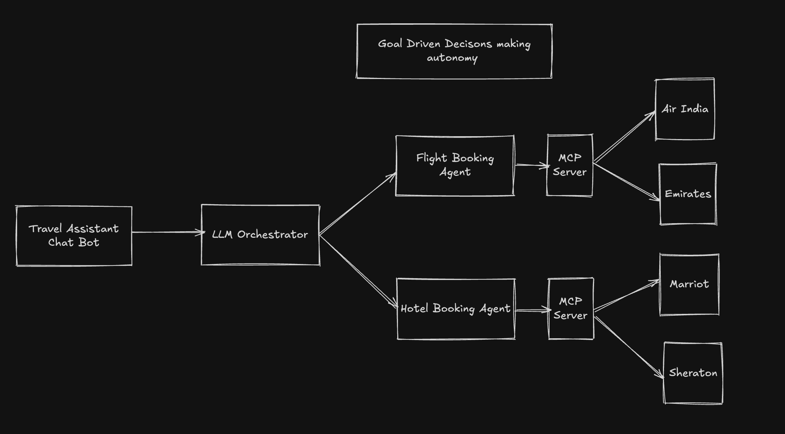

## Travel Assistant (Agno)

Multi-agent travel planner built with Agno and Groq. The coordinator team delegates to a Flight Agent and a Hotel Agent, each using provider tools (mock MCP-like integrations) and applying traveler preferences.

### Features

- Flight search across mock providers (Air India, Emirates, SpiceJet)
- Hotel search across mock brands (Marriott, Sheraton, Accor)
- Preference-aware ranking and concise itinerary summary

### Setup

1. Create and activate a virtual environment.
2. Install dependencies:

```bash
pip install -r travel-assistant/requirements.txt
```

3. Add your API key (Groq):

```bash
echo "GROQ_API_KEY=your_groq_key" > .env
```

### Run

```bash
python travel-assistant/app.py
```

You can also import the factory and build the team in your own app:

```python
from travel_assistant_pkg.team import create_travel_team
team = create_travel_team()
print(team.run("Plan BLR→LND Dec 12-16"))
```

### Sample Prompt

"I want to fly from BLR to LND on Dec 12, return Dec 16, economy, prefer window seat and vegetarian meal. Find a mid-range hotel near Midtown with gym and breakfast."

### Project structure

```
travel-assistant/
  app.py                         # thin entrypoint
  requirements.txt
  travel_assistant_pkg/
    __init__.py
    tools.py                     # AirlineSearchTool, HotelSearchTool
    agents.py                    # create_flight_agent, create_hotel_agent
    team.py                      # create_travel_team
```

### Architecture



### Extend

- Replace mock tools in `travel_assistant_pkg/tools.py` with real MCP providers or API clients.
- Persist user preferences and past trips.
- Add a ground transport agent for airport transfers.
